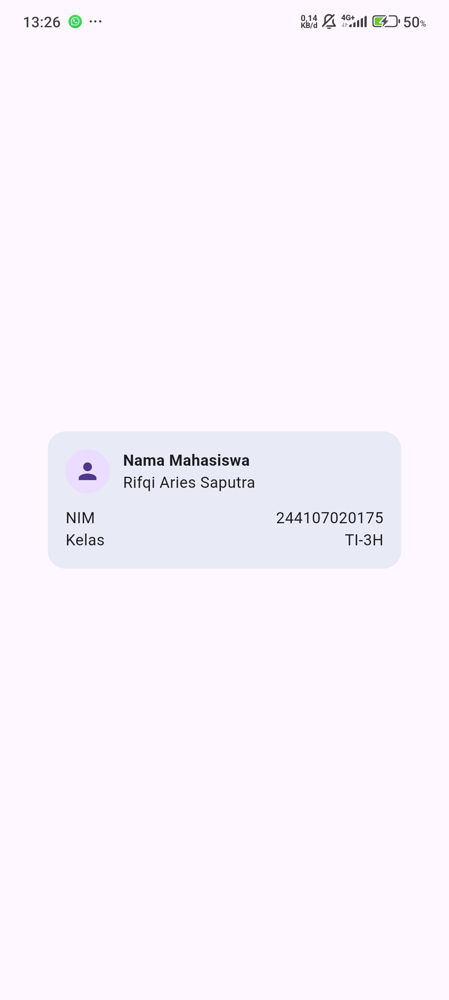

## Dokumentasi layout sederhana

## Dokumentasi dashboard responsive

### Hasil 
*  |

## Tugas Utama

### Ai promt

#### 1.Prompt Desain (Perbandingan Layout)
* **GridView + LayoutBuilder:** Lebih efisien untuk membuat grid kartu dengan jumlah kolom yang dinamis (1 kolom di layar sempit, 2 kolom di layar lebar). Namun, penggunaan `childAspectRatio` harus hati-hati agar konten teks di dalam kartu tidak terpotong saat layar terlalu sempit.
* **LayoutBuilder + Column:** Lebih fleksibel dalam menyesuaikan tinggi kartu secara alami sesuai isi teks, tetapi membutuhkan logika pengelompokan baris yang lebih rumit secara manual.

#### 2. Prompt Penguatan Konsep (Expanded & Overflow)
* `Expanded` berfungsi mengambil sisa ruang kosong secara fleksibel. Namun, jika di dalam `Expanded` ditaruh widget yang tidak memiliki batasan lebar (seperti `Row` lain tanpa batasan atau teks panjang tanpa aturan meluap), Flutter bisa mengalami error *overflow*.
* contoh code gagal 
   Row(
    children: [
      Expanded(
        child: Text('Teks yang sangat panjang sekali tanpa batasan...'),
      ),
    ],
  )
* perbaikan 
    Row(
  children: [
    Expanded(
      child: Text(
        'Teks yang sangat panjang sekali...',
        overflow: TextOverflow.ellipsis, // Menambahkan titik-titik (...) jika meluap
        maxLines: 1,
      ),
    ),
  ],
 )
#### 3. Verification Prompt (Self-Audit)
* **Responsivitas** (< 600px): Aman. Di bawah breakpoint 700px (termasuk layar 360px–480px), layout otomatis beralih menjadi 1 kolom vertikal sehingga tidak ada elemen yang berhimpitan.
* **Aksesibilitas**: Aman dan meningkat. Semua elemen penting (CupertinoSwitch, InfoCard, ProfileHeaderCard) dibungkus dengan widget Semantics agar dapat dibaca dengan jelas oleh screen reader (TalkBack/VoiceOver).
* **Ketersediaan Widget**: Semua widget yang digunakan (LayoutBuilder, GridView, CupertinoSwitch, Semantics, Card) merupakan widget resmi dari SDK Flutter Stabil.

## Refleksi 
