## Dokumentasi layout sederhana

### Hasil 
* Tampilan awal
 |
* Penghapusan expanded 
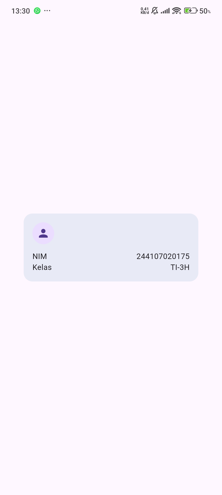 |
* ganti nilai default 
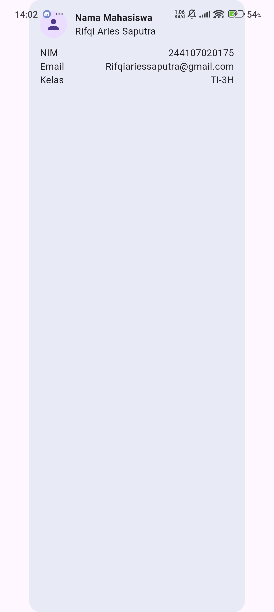 |
* penambahan email
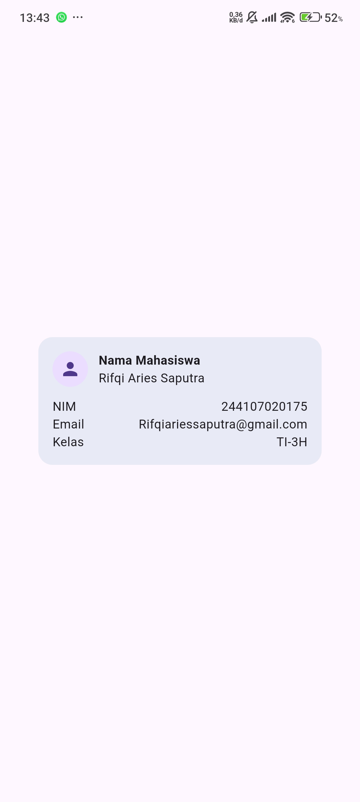 |
## Dokumentasi dashboard responsive

### Hasil
* Tampilan setelah melakukan praktikum
 |
* menganti break point
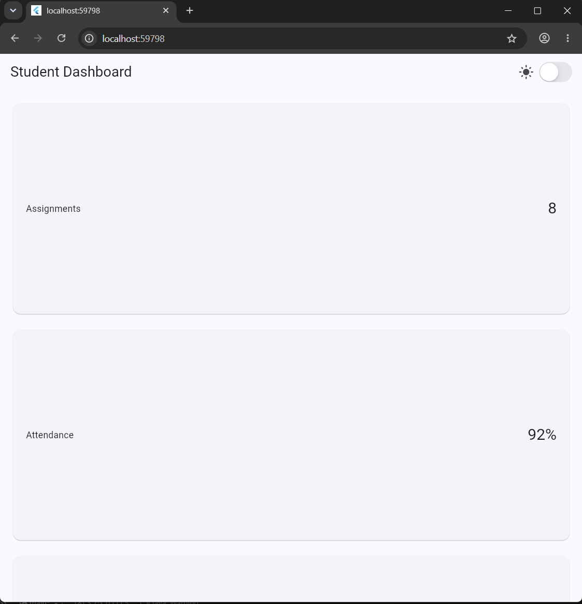 |
* pengantian ThemeMode
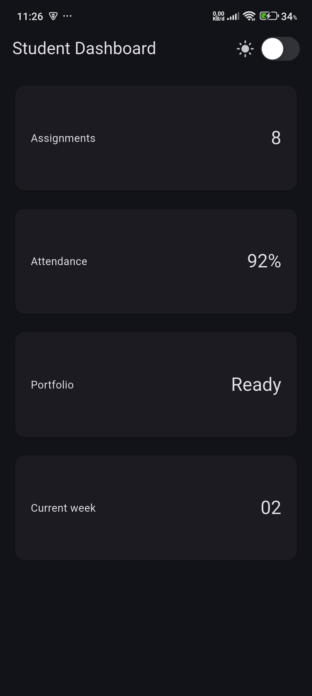 |
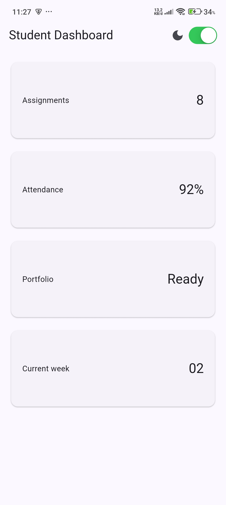 |
* pengujian emulator ukuran berbeda
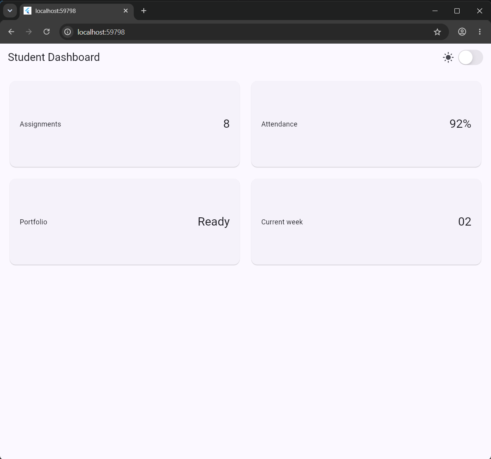 |
* penambahansemantic
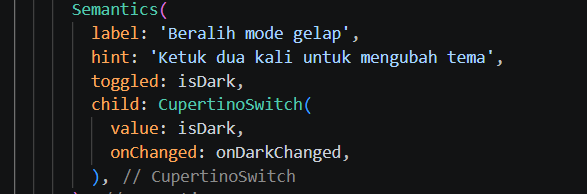 |

### Tugas Utama
* Memiliki header profil dan minimal empat kartu informasi.
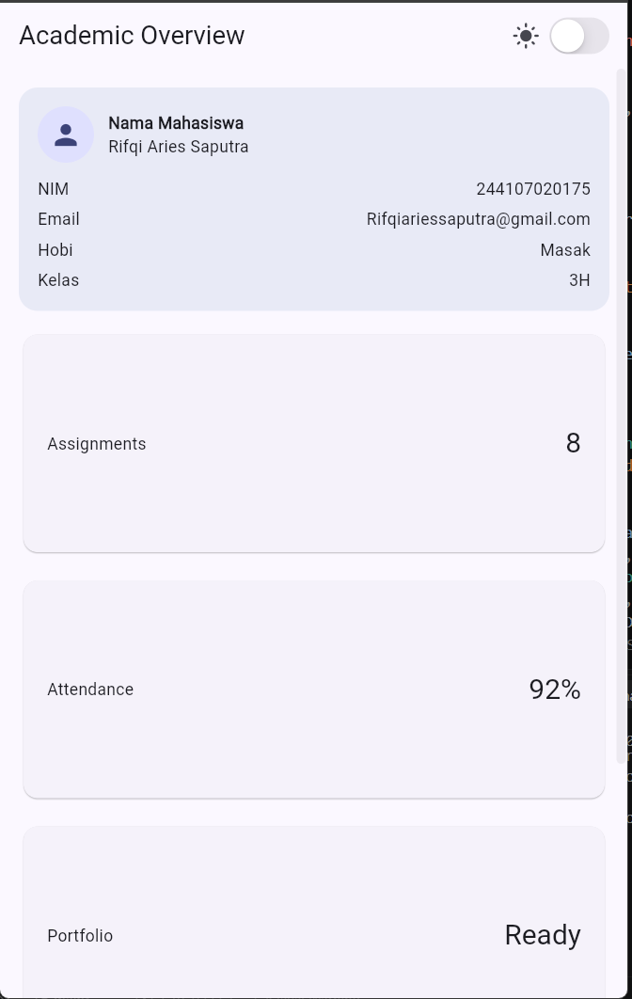 |
* menampilkan satu kolom layar sempit dan dua kolom layar lebar
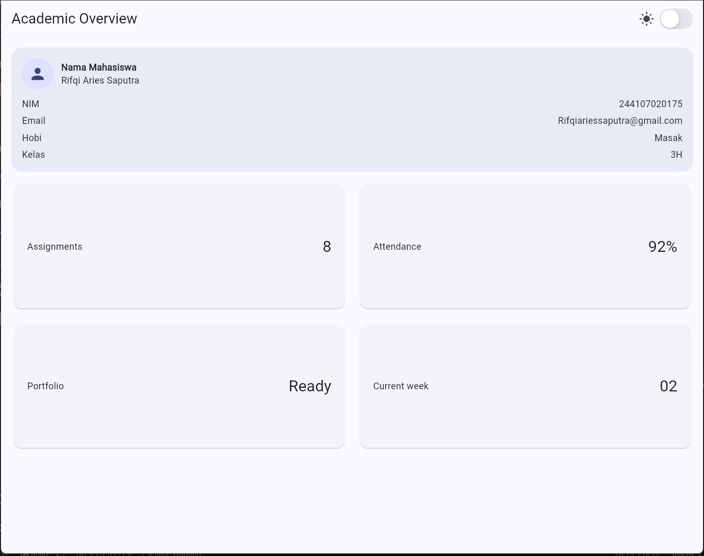 |

### Ai promt
#### 1.Prompt Desain (Perbandingan Layout)
* **GridView + LayoutBuilder:** Lebih efisien untuk membuat grid kartu dengan jumlah kolom yang dinamis (1 kolom di layar sempit, 2 kolom di layar lebar). Namun, penggunaan `childAspectRatio` harus hati-hati agar konten teks di dalam kartu tidak terpotong saat layar terlalu sempit.
* **LayoutBuilder + Column:** Lebih fleksibel dalam menyesuaikan tinggi kartu secara alami sesuai isi teks, tetapi membutuhkan logika pengelompokan baris yang lebih rumit secara manual.

#### 2. Prompt Penguatan Konsep (Expanded & Overflow)
* `Expanded` berfungsi mengambil sisa ruang kosong secara fleksibel. Namun, jika di dalam `Expanded` ditaruh widget yang tidak memiliki batasan lebar (seperti `Row` lain tanpa batasan atau teks panjang tanpa aturan meluap), Flutter bisa mengalami error *overflow*.
* contoh code gagal 
   Row(
    children: [
      Expanded(
        child: Text('Teks yang sangat panjang sekali tanpa batasan...'),
      ),
    ],
  )
* perbaikan 
    Row(
  children: [
    Expanded(
      child: Text(
        'Teks yang sangat panjang sekali...',
        overflow: TextOverflow.ellipsis, // Menambahkan titik-titik (...) jika meluap
        maxLines: 1,
      ),
    ),
  ],
 )
#### 3. Verification Prompt (Self-Audit)
* **Responsivitas** (< 600px): Aman. Di bawah breakpoint 700px (termasuk layar 360px–480px), layout otomatis beralih menjadi 1 kolom vertikal sehingga tidak ada elemen yang berhimpitan.
* **Aksesibilitas**: Aman dan meningkat. Semua elemen penting (CupertinoSwitch, InfoCard, ProfileHeaderCard) dibungkus dengan widget Semantics agar dapat dibaca dengan jelas oleh screen reader (TalkBack/VoiceOver).
* **Ketersediaan Widget**: Semua widget yang digunakan (LayoutBuilder, GridView, CupertinoSwitch, Semantics, Card) merupakan widget resmi dari SDK Flutter Stabil.

### Refactoring challenge
* hasil flutter analyze
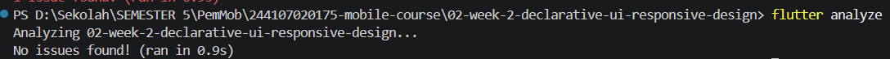 |

### Testing dasar
* hasil flutter test 
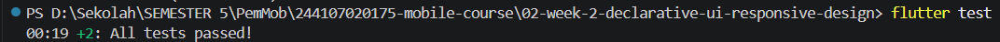 |

## Refleksi 

### 1. Perbedaan Cara Berpikir Imperative dan Declarative saat Membangun UI
* **Imperative (Cara Lama/Tradisional):** Kita secara manual menginstruksikan langkah demi langkah bagaimana UI harus berubah saat ada interaksi (misalnya: *"Ambil elemen tombol ini, ubah warnanya jadi biru, lalu ubah teks label di dalamnya"*).
* **Declarative (Cara Flutter):** Kita cukup mendeskripsikan bagaimana bentuk UI untuk suatu keadaan/state tertentu (`UI = f(state)`). Ketika state berubah (misalnya nilai `isDark` berubah), Flutter secara otomatis membangun ulang (*rebuild*) tampilan UI sesuai keadaan state terbaru tanpa perlu manipulasi elemen secara manual satu per satu.

### 2. Penggunaan `Expanded`: Kapan Membantu vs Menghasilkan Layout Error
* **Kapan Membantu:** `Expanded` sangat berguna di dalam widget flex (`Row`, `Column`, `Flex`) ketika kita ingin suatu widget mengambil seluruh sisa ruang kosong yang tersedia, atau agar teks panjang tidak terpotong keluar dari layar (*overflow*).
* **Kapan Menghasilkan Error:** `Expanded` akan menyebabkan error (*Unbounded Constraints*) jika diletakkan di dalam widget yang tidak memberikan batasan ukuran atau memiliki ruang tanpa batas secara teoritis—seperti di dalam `Column` tanpa batas tinggi, di dalam `ListView` vertikal, atau jika di-nesting secara tidak tepat tanpa batasan fleksibel.

### 3. Pengaruh Breakpoint dan Theme terhadap Pengalaman Pengguna (UX)
* **Breakpoint:** Memastikan tata letak aplikasi beradaptasi dengan ukuran layar perangkat pengguna secara efisien. Pada layar HP sempit, layout 1 kolom menjaga konten tetap terbaca tanpa terdesak; sedangkan pada layar tablet/desktop, layout 2 kolom memanfaatkan sisa ruang horizontal agar aplikasi tidak terlihat kosong.
* **Theme (Light/Dark):** Meningkatkan kenyamanan visual pengguna di berbagai kondisi pencahayaan. Mode gelap mengurangi kelelahan mata di tempat redup dan menghemat baterai (terutama pada layar OLED), sementara mode terang memberikan keterbacaan yang tinggi saat penggunaan di bawah sinar matahari/ruangan terang.

### 4. Hal yang Diverifikasi dari Rekomendasi AI setelah Tugas Inti Selesai
* **Validitas Kode & API:** Memastikan rekomendasi kode AI menggunakan sintaks Flutter stabil terbaru (bukan widget yang sudah *deprecated*) dan lulus dari pemeriksaan `flutter analyze`.
* **Uji Responsivitas & Layout:** Memverifikasi secara langsung di emulator bahwa penentuan breakpoint AI tidak membuat tampilan terpotong (*overflow*) pada ukuran layar di bawah 600px.
* **Integrasi Aksesibilitas:** Memastikan penggunaan widget `Semantics` yang disarankan AI benar-benar mempermudah *screen reader* tanpa merusak tata letak visual aplikasi.
* **Pengujian Otomatis:** Memastikan skenario tes responsivitas pada `widget_test.dart` berhasil dijalankan lewat perintah `flutter test` tanpa kegagalan assertion.
