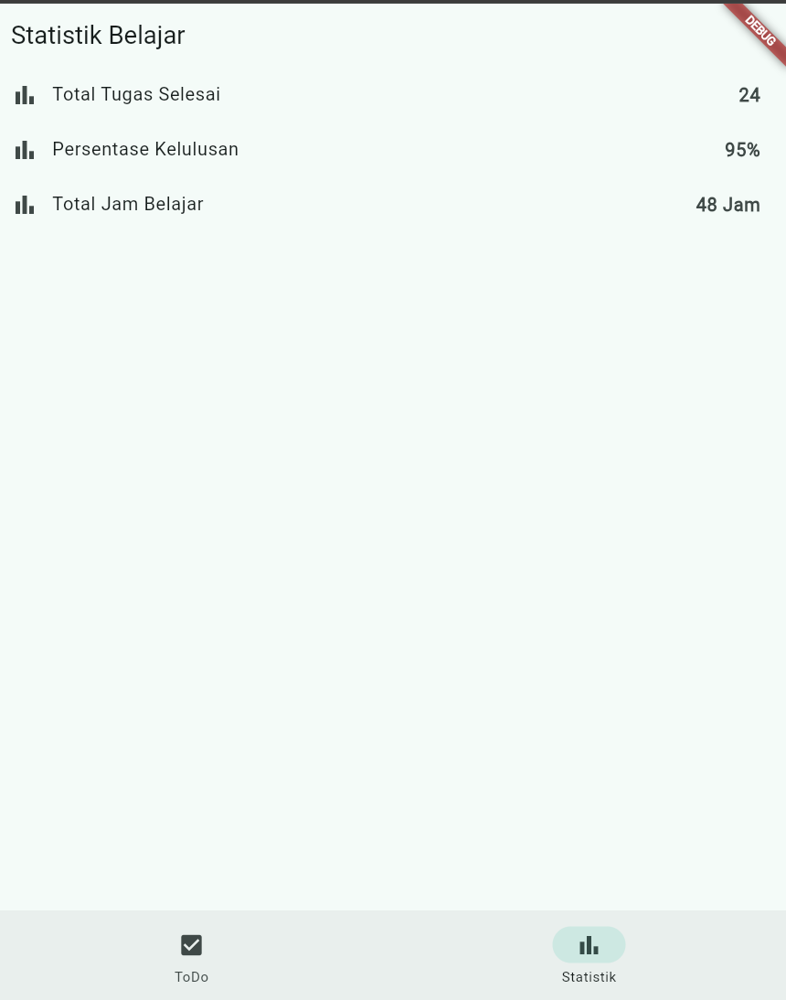
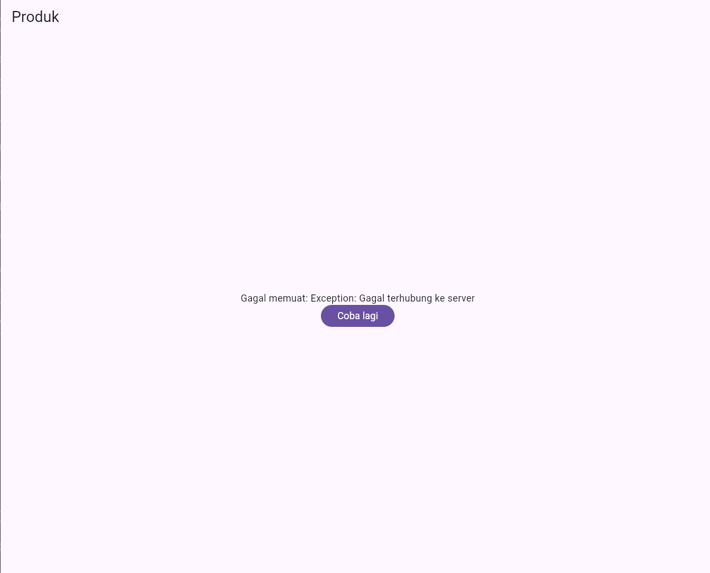
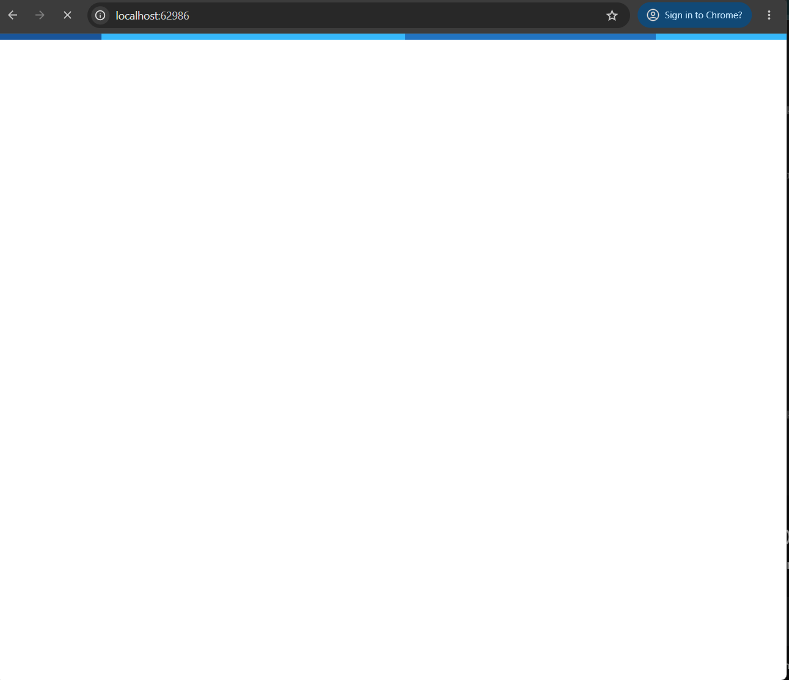
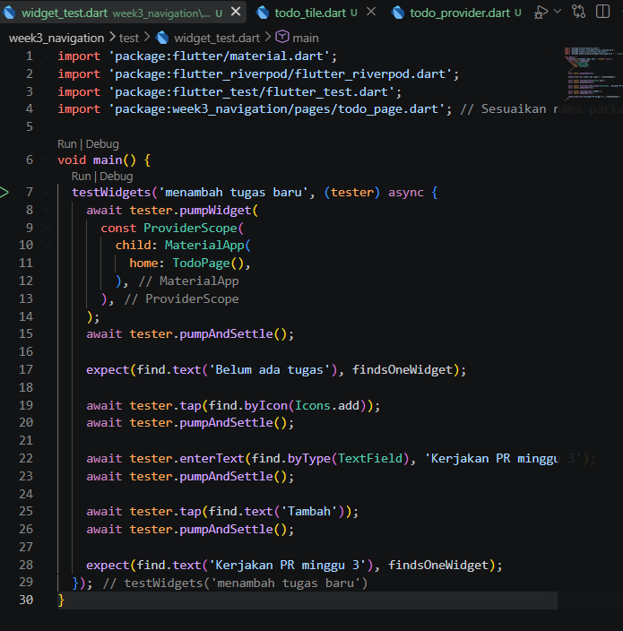

# Laporan Week 3

## Mini project 

###  Navigasi 2 Halaman dengan gorouter

### fitur simulasi loading 
* percobaan loading dan gagal

### penambahan widget testing 
 * penambahan widget test

 * pengujian lulus 

### AI Challenge & Dokumentasi Teknis
* **Prompt Utama:** `"Buatkan halaman Flutter bernama StatsPage menggunakan flutter_riverpod dengan ConsumerWidget dan AsyncNotifierProvider (delay 2 detik, simulasi error 30%). UI harus menangani loading, error, dan success. Buatkan juga unit test notifier-nya."`
* **Evaluasi & Perbaikan:** 
  * Memperbaiki kesalahan penggunaan parameter `padding` pada widget `Center`.
  * Memastikan immutability state dan pemisahan `ref.watch` (di `build`) & `ref.read` (di `callback`).

## Refleksi

### Kapan setState masih cukup, dan kapan state harus naik ke Riverpod?

 * Gunakan setState ketika state bersifat lokal dan visual dan hanya relevan untuk satu widget saja. 

 * gunakan riverpod ketika state perlu diakses oleh beberapa widget/halamansekaligus.

### Apa perbedaan context.go dan context.push, dan kapan masing-masing tepat digunakan?

 * context.go berfungsi untuk mengganti seluruh tumpukan navigasi sesuai jalur lokasi rute dan digunakan untuk navigasi utama/tab agar riwayat tumpukan rute tetap bersih.
 * context.push berfungsi untuk menumpuk rute baru atas rute yang sedang aktif tanpa mereset stack dan digunakan untuk alur navigasi hirarkis sehingga pengguna bisa menekan tombol back untuk kembali.

### Bagaimana AsyncValue mencegah bug dibanding tiga boolean terpisah?

 * masalah penggunaan 3 boolean dapat menimbuulkan imposible states atau bug visual seperti loading maupun eror saat load.
 * solusi nya dengan menggunakan pola pattern matching yang menjamin state bersifat type-safe dan mutually exclusive.

### Bagian mana dari hasil AI yang Anda perbaiki, dan mengapa?

 * perbaikan ui loading dengan menghapus parameter padding dari dalam widget center pada state loading dan membungkusnya dengan widget padding di luar center. Perbaikan ini dilakukan karena center di flutter tidak memiliki properti padding sehingga yang sebelumnya menyebabkan eror 
 * penyelarasan import tst dengan mengubah relative path pada import pada file stat_notifier_test.dart menjadi package import(package:week3_navigation/...) untuk mematuhi standar linear flutter dan mencegah eror
 * pemisahan ref.watch dan ref.read dengan memastikan ref.watch hanya dipanggil di dalam method build() untuk reaksi UI, sedangkan ref>read digunakan pada event callback guna mengeliminasi unnecessary rebuilds.