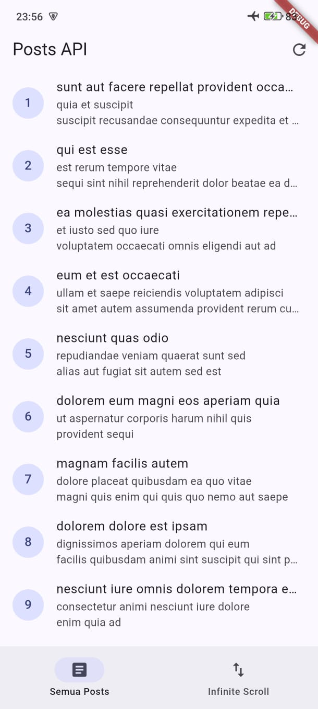
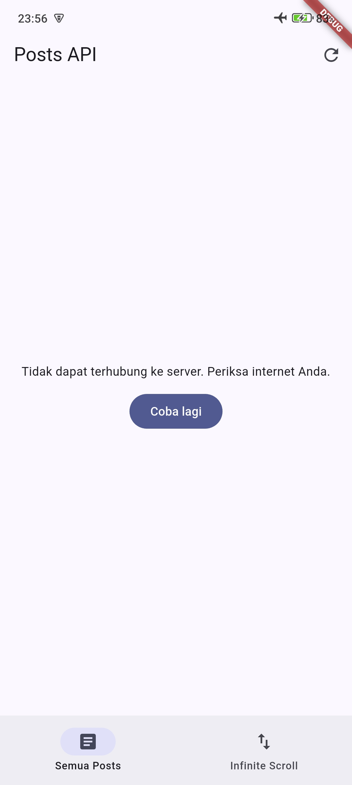
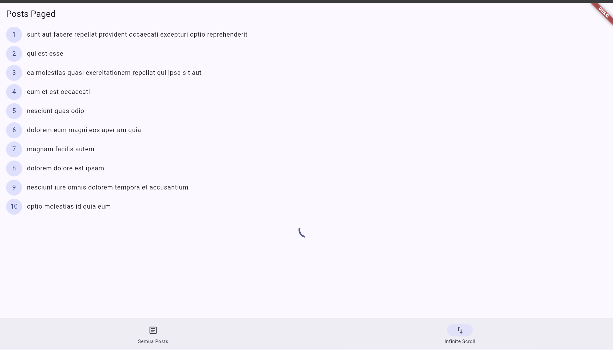
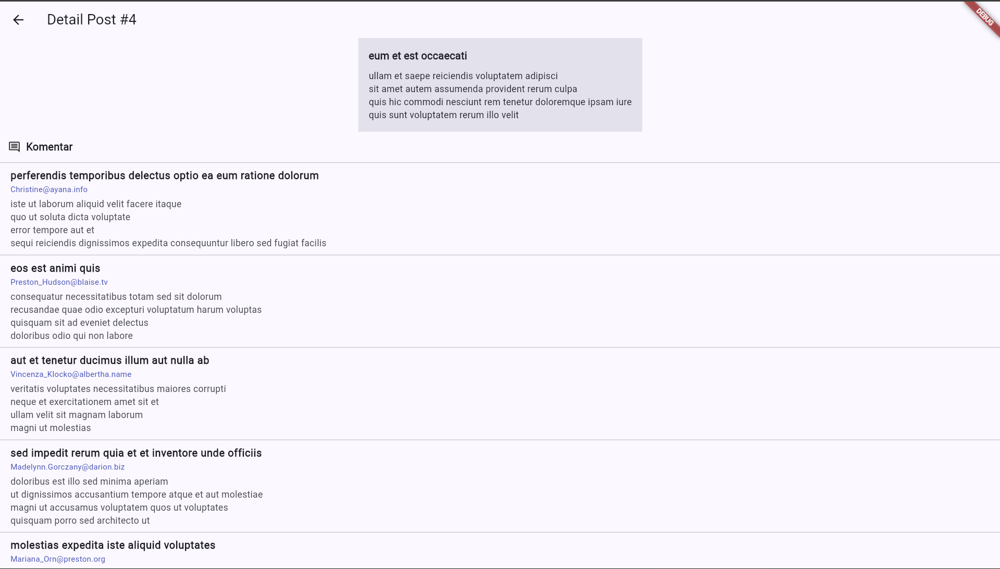
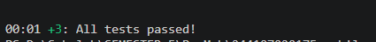
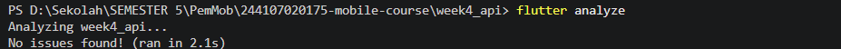

# Laporan Praktikum — Minggu 04: Networking & REST API

## praktikum 2
-----------------------------------
### Hasil Uji 



## praktikum 3
-----------------------------------
### infinity


## AI chalenge
-----------------------------------
### coment section

```text
[✓] UI tidak memanggil Dio secara langsung (isolasi di repository)
[✓] fromJson aman null (menggunakan fallback default ?? 0 / ?? '')
[✓] Seluruh tipe DioExceptionType dipetakan ke pesan ramah pengguna
[✓] baseUrl dan timeout 10 detik terpusat di api_client.dart
[✓] Unit test menguji kasus field hilang / edge case (comment_model_test.dart)
[✓] flutter analyze: 0 warning / 0 error
[✓] flutter test: All tests passed

## Refaktoring dan test
-----------------------------------
### hasil test dan analyze



## Refleksi 
-----------------------------------
### 1. Mengapa UI dilarang memanggil Dio langsung? Apa yang rusak jika aturan ini dilanggar?
* **Penyebab Dilarang:** Memanggil `Dio` langsung dari UI melanggar prinsip *Separation of Concerns* (Pemisahan Tanggung Jawab) dan *Clean Architecture*. Tampilan (UI) seharusnya hanya fokus pada bagaimana data ditampilkan, bukan bagaimana data diambil dari internet.
* **Dampak Jika Dilanggar:**
  * **Sulit Diuji (Untestable):** UI tidak bisa di-test menggunakan *Unit Test* karena ketergantungan langsung pada koneksi internet dan API sungguhan (*tight coupling*).
  * **Duplikasi Kode:** Konfigurasi HTTP (seperti `baseUrl`, `headers`, `timeout`, dan *error handling*) harus ditulis berulang kali di setiap widget yang membutuhkan data.
  * **Maintenance Buruk:** Jika endpoint API atau library networking berubah (misalnya berpindah dari `Dio` ke `http`), seluruh file UI harus diubah satu per satu.

---

### 2. Kapan pagination client-side cukup, dan kapan harus mengandalkan pagination server (`_page`/`_limit`)?
* **Pagination Client-Side Cukup:**
  * Saat total data dari server **berjumlah kecil** (misalnya kurang dari 100–200 item).
  * Data berukuran ringan dan jarang berubah.
  * Server tidak menyediakan API/endpoint pagination.
  * Kelebihannya: Proses pencarian dan *sorting* di UI terasa sangat cepat setelah seluruh data terunduh di awal.
* **Harus Mengandalkan Pagination Server (`_page`/`_limit`):**
  * Saat data berjumlah sangat besar (ratusan, ribuan, atau *infinite data* seperti *feed* media sosial).
  * Ukuran payload data besar (memuat banyak gambar/detail).
  * Menghemat konsumsi kuota internet pengguna dan penggunaan memori (RAM) pada perangkat *mobile*.
  * Mencegah aplikasi mengalami *lag* atau *crash* saat memuat ribuan data sekaligus ke dalam *widget tree*.

---

### 3. Bagaimana exception repository berubah menjadi AsyncError tanpa try/catch di setiap widget? Kapan try/catch eksplisit tetap dibutuhkan?
* **Perubahan Menjadi `AsyncError`:**
  * Pada Riverpod (seperti `AsyncNotifier` atau `FutureProvider`), *method* `build()` menjalankan fungsi asinkron.
  * Riverpod secara otomatis membungkus (*wrap*) seluruh eksekusi fungsi di dalamnya. Jika `Repository` melemparkan *exception*, Riverpod menangkap *exception* tersebut dan mengonversi *state* provider menjadi `AsyncError(error, stackTrace)`.
  * Di sisi UI, kita tinggal menggunakan penanganan deklaratif `asyncValue.when(data: ..., error: ..., loading: ...)` tanpa perlu menulis blok `try-catch` di method `build()` UI.
* **Kapan `try-catch` Eksplisit Tetap Dibutuhkan?**
  * **User Action / Side Effects:** Saat melakukan aksi imperatif seperti menekan tombol Simpan/Kirim (*Form Submit*), *Delete*, atau *Refresh* manual.
  * **Navigasi & Feedback UI Impulsif:** Saat kita ingin menampilkan `SnackBar`, `AlertDialog`, atau melakukan navigasi halaman tepat setelah sebuah fungsi gagal/berhasil dieksekusi.

---

### 4. Bagian mana dari hasil AI yang Anda perbaiki, dan mengapa?
* **Penanganan Null Safety & Tipe Data pada Model:** 
  * *Perbaikan:* Menambahkan pengecekan defensif `(json['field'] as num?)?.toInt() ?? 0` dan `.toString()` pada model `Comment` dan `Post`.
  * *Alasan:* Mencegah *Red Screen of Death* atau *type cast error* jika API mengembalikan nilai `null`, field hilang, atau mengirim angka dalam format string.
* **Perbaikan Deprecated API Material 3:**
  * *Perbaikan:* Memperbaiki penggunaan `Theme.of(context).colorScheme.surfaceVariant` menjadi `surfaceContainerHighest`.
  * *Alasan:* `surfaceVariant` sudah *deprecated* pada versi SDK Flutter terbaru, sehingga perbaikan ini membuat kode bersih (*0 issues*) saat dijalankan `flutter analyze`.
* **Pembersihan Linter & Parameter Unused:**
  * *Perbaikan:* Mengubah penulisan `(_, __)` menjadi `(_, _)` pada `ListView.separated`.