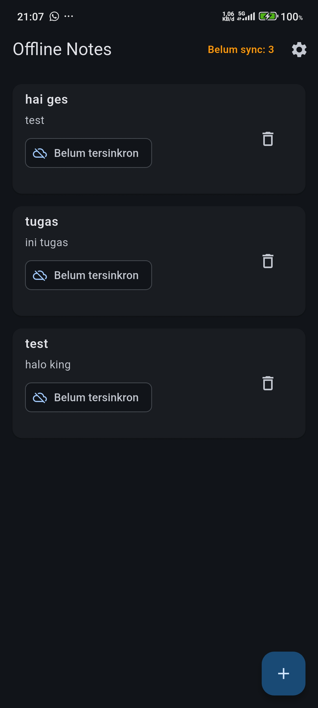
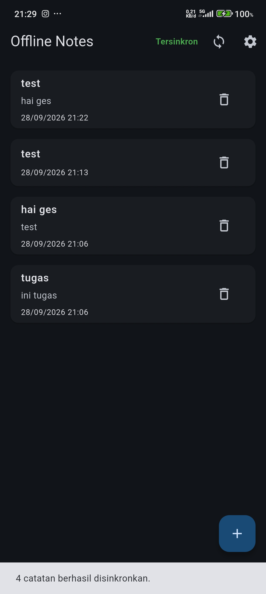
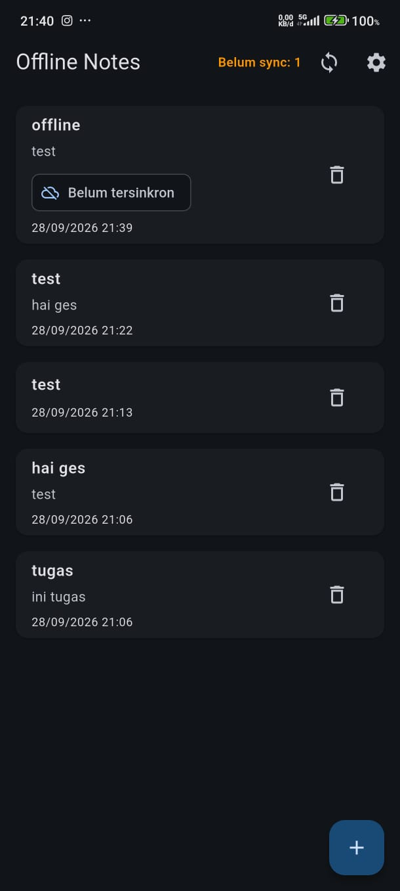
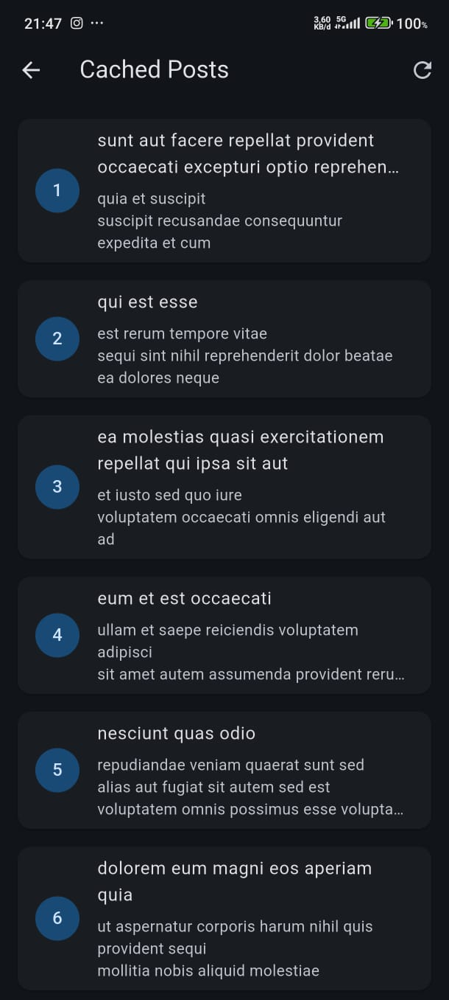
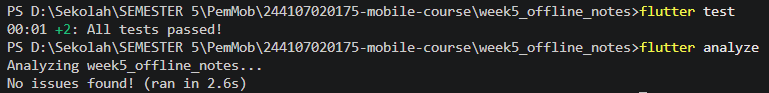

# PRAKTIKUM 5 - LOCAL STORAGE & OFFLINE FIRST

#### Nama    : Rifqi Aries Saputra 
#### NIM     : 244107020175
#### kelas   :TI-3H

## tujuan praktikum 
Pada praktikum ini dilakukan implementasi penyimpanan data lokal dan konsep
offline-first pada aplikasi Flutter.

Implementasi yang dilakukan meliputi:

- Penyimpanan pengaturan menggunakan SharedPreferences.
- Penyimpanan data catatan menggunakan SQLite.
- Implementasi CRUD data catatan.
- Penerapan Riverpod sebagai state management.
- Penerapan Repository Pattern.
- Implementasi dirty flag untuk menandai data yang belum tersinkronisasi.
- Simulasi proses sinkronisasi data.
- Implementasi mode offline.
- Implementasi cache-first untuk mengambil data.
- Menampilkan detail catatan.

## Hasil pengerjaan praktikum 

### pergantian tema

### Penambahan Note

### sinkronisasi 

### offline force

### cache post

## Hasil Test 

## Refleksi
1. Apa yang saya pelajari dari praktikum ini?

Pada praktikum ini saya mempelajari cara menyimpan data secara lokal pada
aplikasi Flutter menggunakan SharedPreferences dan SQLite.

Selain itu, saya juga mempelajari konsep offline-first, cache-first,
repository pattern, state management menggunakan Riverpod, serta penggunaan
dirty flag untuk menandai data yang belum tersinkronisasi.

2. Apa tantangan yang saya hadapi?

Tantangan yang dihadapi adalah memahami hubungan antara UI, state management,
repository, dan database lokal.

Selain itu, diperlukan pemahaman mengenai bagaimana data tetap dapat
ditampilkan ketika aplikasi berada dalam kondisi offline.

3. Bagaimana cara saya mengatasi tantangan tersebut?

Tantangan tersebut diatasi dengan membagi aplikasi menjadi beberapa bagian,
yaitu UI, provider/state management, repository, dan local database.

Dengan pemisahan tersebut, setiap bagian memiliki tanggung jawab masing-masing
sehingga proses pengembangan dan debugging menjadi lebih mudah.

4. Apa manfaat konsep offline-first?

Konsep offline-first membuat aplikasi tetap dapat digunakan ketika koneksi
internet tidak tersedia.

Data yang sudah tersimpan secara lokal dapat digunakan kembali sehingga
pengguna tidak sepenuhnya bergantung pada koneksi internet.

## Kesimpulan 
Praktikum Week 5 berhasil menerapkan local storage dan konsep offline-first
pada aplikasi Flutter.

SharedPreferences digunakan untuk menyimpan pengaturan sederhana, sedangkan
SQLite digunakan untuk menyimpan data catatan.

Selain itu, aplikasi telah menerapkan Riverpod, Repository Pattern, dirty
flag, simulasi sinkronisasi, force offline, dan cache-first.

Pengujian menggunakan Flutter Test berhasil dijalankan dan kode juga telah
diperiksa menggunakan Flutter Analyze.