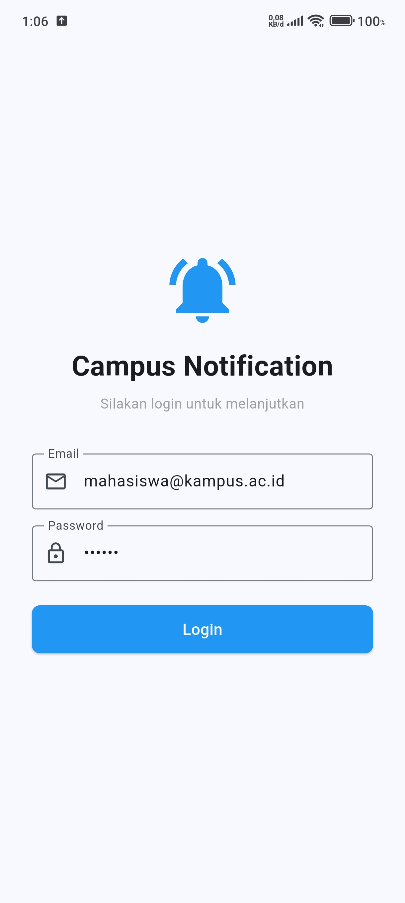
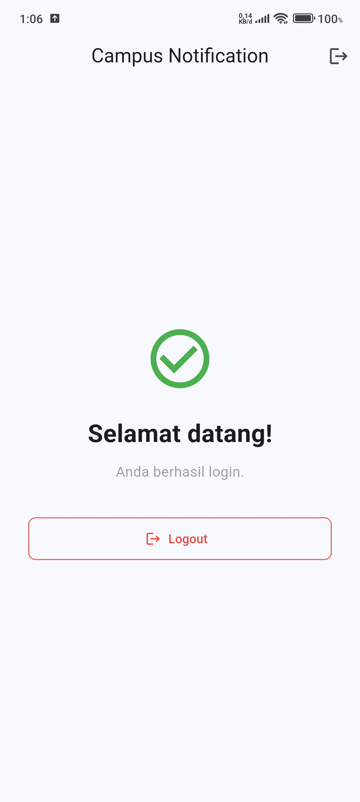
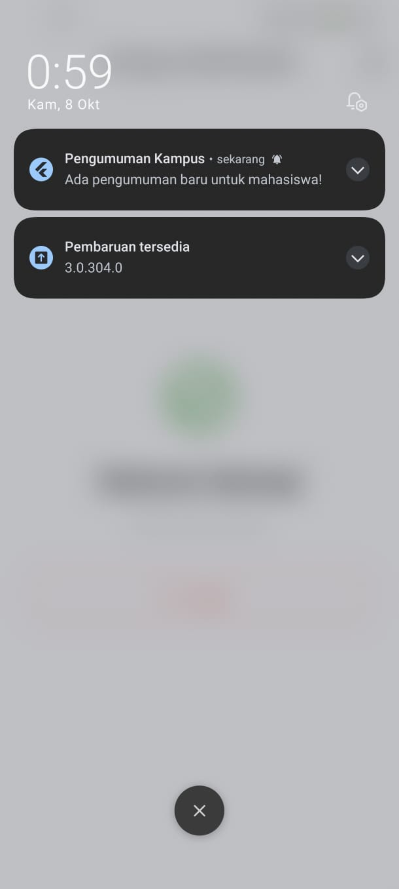
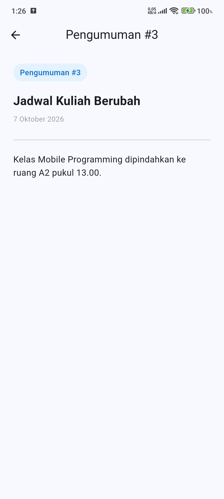

# Jobsheet 6: Authentication, Security & FCM

## 1. Identitas

| Field | Nilai |
|-------|-------|
| Nama  | *Rifqi Aries Sputra * |
| NIM   | *244107020175* |
| Kelas | *TI-3H* |

---

## 2. Langkah-Langkah Pengerjaan

Berikut adalah tahapan implementasi yang telah dilakukan untuk menyelesaikan Jobsheet ini:

1. **Setup Project dan Dependencies**: Membuat project Flutter baru dan menambahkan library yang dibutuhkan (`flutter_riverpod`, `go_router`, `dio`, `flutter_secure_storage`, `firebase_core`, `firebase_messaging`, `flutter_local_notifications`).
2. **Implementasi Secure Storage**: Membuat `token_store.dart` untuk menyimpan `access_token` dan `refresh_token` dengan aman ke dalam *Keychain/EncryptedSharedPreferences*.
3. **Pembuatan Auth Repository (Mock)**: Membuat logika mock login (dengan email dan password statis) serta fungsi refresh token di `auth_repository.dart`.
4. **Konfigurasi API Client (Dio Interceptor)**: Mengatur interceptor pada `api_client.dart` untuk otomatis menyematkan token pada header request dan menangani *refresh token* jika terjadi error HTTP 401.
5. **State Management & Route Guard**: Mengelola state login dengan `auth_provider.dart` (Riverpod) dan menerapkan batasan akses halaman (Route Guard) menggunakan `go_router` agar user yang belum login terlempar ke halaman `/login`.
6. **Pembuatan Halaman UI**: Membangun tampilan antarmuka untuk `LoginPage`, `HomePage` (berisi tombol logout), dan `AnnouncementPage`.
7. **Setup Firebase Cloud Messaging (FCM)**: Menghubungkan aplikasi ke Firebase menggunakan `flutterfire configure`, serta meminta *permission* notifikasi pada OS Android.
8. **Konfigurasi Notifikasi (Foreground, Background, Terminated)**: Membuat `notification_service.dart` agar aplikasi bisa memunculkan notifikasi baik saat sedang dibuka maupun ditutup, dan otomatis membuka halaman Pengumuman ketika notifikasi ditekan.
9. **Testing Aplikasi**: Menguji secara manual dan melalui unit test (terdapat 18 unit test yang mencakup auth, storage, router, dan data payload notifikasi).

---

## 3. Hasil Tampilan (Screenshots)

Berikut adalah dokumentasi hasil dari aplikasi yang telah berjalan:

**1. Halaman Login**
*(Tampilan saat user pertama kali membuka aplikasi atau belum login)*
> 

**2. Halaman Setelah Login (Home)**
*(Tampilan Home beserta tombol logout setelah login berhasil)*
> 

**3. Notifikasi Masuk**
*(Notifikasi push dari FCM yang muncul di status bar / tray Android)*
> 

**4. Halaman Pengumuman**
*(Halaman spesifik yang terbuka secara otomatis saat user meng-klik notifikasi)*
> 

---

## 4. Refleksi & Jawaban Pertanyaan

**1. Mengapa kita menggunakan `flutter_secure_storage` alih-alih `SharedPreferences` untuk menyimpan token autentikasi?**
> **Jawaban:** 
> `SharedPreferences` menyimpan data dalam format plain-text (teks biasa) di penyimpanan lokal, yang membuatnya rentan dibaca oleh pihak tidak bertanggung jawab jika perangkat di-root atau diakses secara fisik. Sebaliknya, `flutter_secure_storage` menyimpan data secara terenkripsi dengan memanfaatkan sistem keamanan native bawaan sistem operasi (seperti Keychain di iOS dan EncryptedSharedPreferences/Keystore di Android), sehingga jauh lebih aman untuk menyimpan informasi rahasia seperti *access token* dan *refresh token*.

**2. Apa kegunaan utama dari Interceptor pada Dio dalam konteks aplikasi ini?**
> **Jawaban:**
> Interceptor bertindak sebagai *middleware* untuk mencegat setiap HTTP request dan response. Dalam aplikasi ini kegunaannya adalah:
> - **Request:** Mengambil access token dari secure storage dan menyematkannya ke header `Authorization` secara otomatis pada setiap request, sehingga tidak perlu menulisnya berulang kali.
> - **Response/Error:** Menangkap error spesifik seperti HTTP 401 (Unauthorized). Saat error ini terjadi, interceptor secara otomatis menjeda request, melakukan refresh token ke server, lalu mengulang (*retry*) request asli yang gagal tadi tanpa diketahui atau disadari oleh pengguna.

**3. Jelaskan perbedaan penanganan push notification saat aplikasi berada di kondisi *Foreground*, *Background*, dan *Terminated*!**
> **Jawaban:**
> - **Foreground (Aplikasi sedang aktif dibuka):** OS tidak otomatis menampilkan notifikasi di tray. Kita harus menangkap pesannya menggunakan `FirebaseMessaging.onMessage.listen()` dan menampilkan notifikasi secara manual di layar menggunakan library tambahan seperti `flutter_local_notifications`.
> - **Background (Aplikasi di-minimize / tidak tampil di layar utama):** OS otomatis menampilkan notifikasi di system tray. Jika user menekan notifikasi tersebut, kita bisa menangkap aksinya menggunakan `FirebaseMessaging.onMessageOpenedApp.listen()` untuk diarahkan ke halaman tertentu.
> - **Terminated (Aplikasi ditutup paksa / force close):** OS otomatis menampilkan notifikasi di system tray. Ketika notifikasi ditekan, aplikasi akan dibuka dari awal (cold start). Kita dapat mengambil data dari notifikasi yang membuka aplikasi menggunakan metode `FirebaseMessaging.instance.getInitialMessage()` di awal inisialisasi aplikasi.

**4. Mengapa sistem autentikasi modern membutuhkan *Refresh Token*, padahal kita sudah memiliki *Access Token*?**
> **Jawaban:**
> Ini adalah bagian dari praktik keamanan (Security Best Practices). *Access Token* memiliki umur kadaluarsa (expiry time) yang sangat singkat (misal: 15-30 menit) agar jika token tersebut dicuri, peretas hanya bisa menggunakannya dalam waktu yang singkat. Karena umurnya pendek, user akan sering ter-logout. Di sinilah peran *Refresh Token*. Refresh Token umurnya jauh lebih panjang (bisa berhari-hari atau berbulan-bulan) dan digunakan murni **hanya** untuk meminta Access Token baru ke server di belakang layar. Dengan ini, keamanan tetap tinggi namun UX (pengalaman pengguna) tetap nyaman karena user tidak perlu berulang kali mengetik email dan password.
